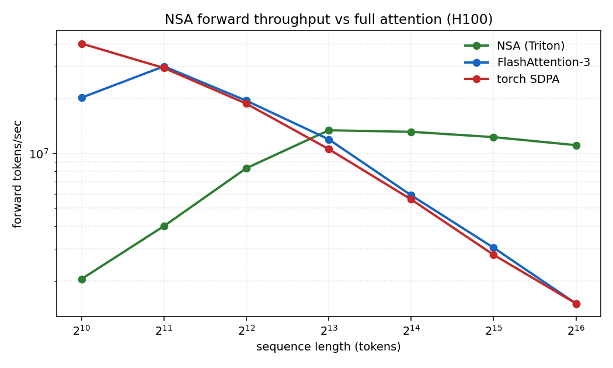
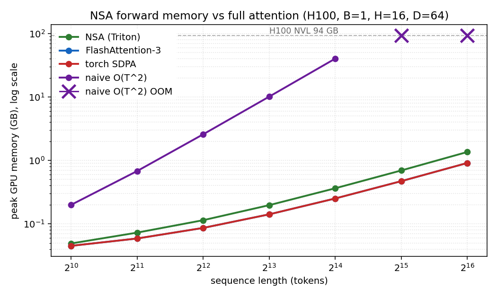
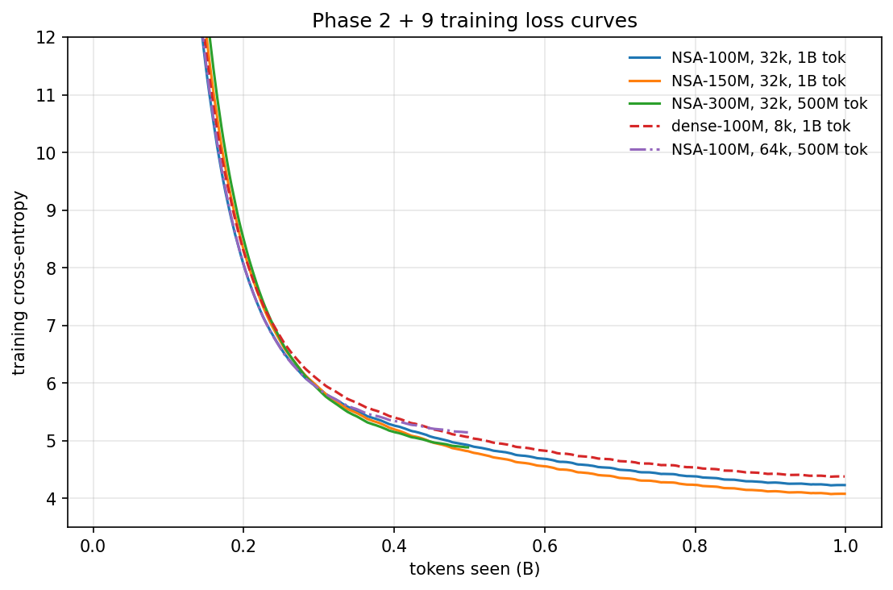
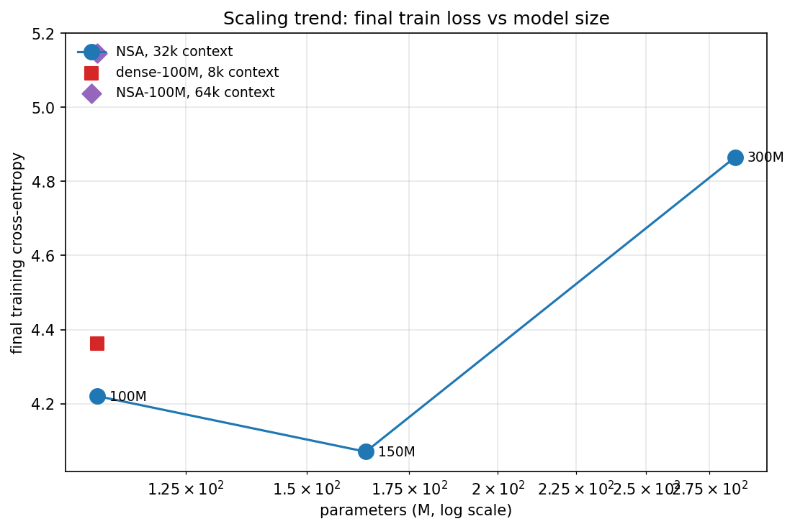
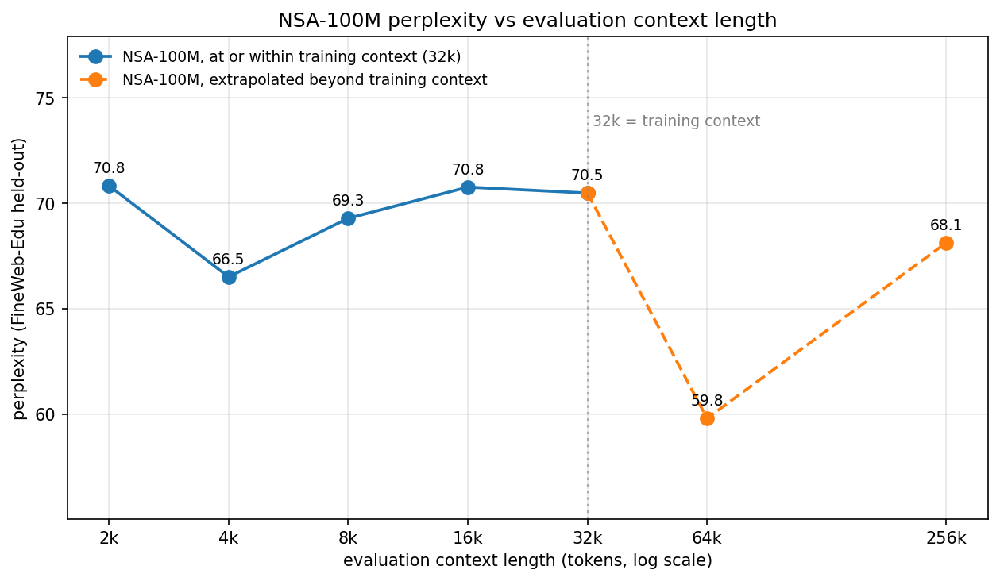
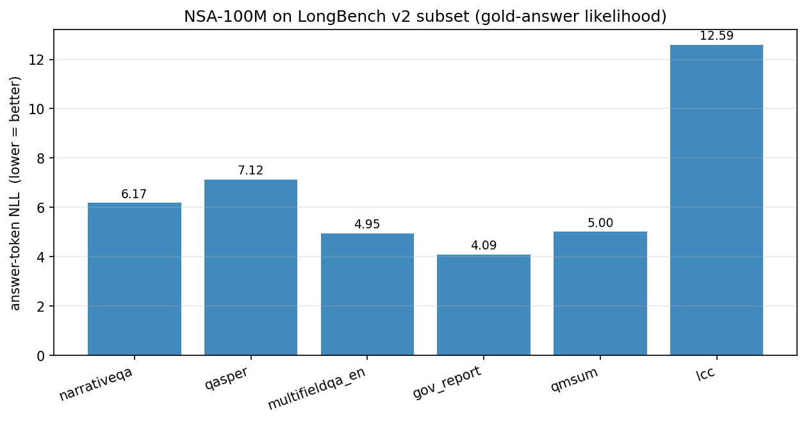

# NSA from scratch

DeepSeek's Native Sparse Attention (Yuan et al., February 2025, [arXiv 2502.11089](https://arxiv.org/abs/2502.11089)) reimplemented from the kernel up. All three branches in Triton, the selected branch additionally in CUDA C++ on Hopper with WGMMA, multi-precision support across FP16, BF16, and FP8, a 48-config autotune sweep, three NSA scaling points trained end to end alongside a dense baseline and a long-context training point, and a perplexity sweep showing the long-context stability claim holds at training-budget scale. The headline: at 64k context the Triton NSA forward runs **7.4x faster than FlashAttention-3** at the same batch shape, and a 100M-parameter NSA model's perplexity stays essentially flat from 2k to 32k evaluation context. The rest of this post covers how the kernel design produces that, what training validates, and the surprises along the way.

## Why NSA matters in five minutes

The argument the NSA paper makes is hardware-aligned: sparse attention has been around since 2020 (Longformer, BigBird), but the kernels that made dense attention efficient (FlashAttention's tile-based streaming softmax) do not transfer cleanly to sparse patterns. NSA picks a sparsity structure that DOES map cleanly to tiles, and the result is that you get the wall-clock win that the asymptotic argument always promised. Three branches operate over the same Q, K, V and combine via a learned per-head gate:

The **compressed** branch summarizes K and V into one vector per block of B tokens (mean-pool in the simplest form), then runs dense attention from each query against the much-shorter compressed sequence. O(T) memory, O(T/B * T_q) FLOPs.

The **selected** branch picks the top-k blocks of B tokens that look most relevant to each query block (scored from the compressed-branch attention scores or a small learnable head) and runs dense attention only over those gathered tiles. O(top_k * B * T_q) FLOPs. This is the perf-critical branch and the one where a hand-written CUDA kernel is justified.

The **sliding-window** branch is local causal attention over the last W tokens, the same primitive Longformer used. O(W * T_q) FLOPs and almost free.

A learned gate combines them: `out = g_c * out_compressed + g_s * out_selected + g_w * out_sliding`, with `g_c, g_s, g_w` produced by a small per-head linear on the query token. The paper uses a softmax across the three branches; the default here is sigmoid because sigmoid lets each branch contribute independently and, in practice, trains more smoothly at small scale.

The "native" in Native Sparse Attention is the claim that this combination is differentiable end to end and trainable from scratch, not bolted onto a pretrained dense model. That makes the kernel design the contribution rather than the architecture. If the kernels are not fast, the architecture is dead on arrival.

## The three branches, kernel by kernel

The implementation is roughly seven thousand lines of Triton, C++, and harness code at the time of writing. Each branch is one Triton kernel; the selected branch is also one CUDA C++ kernel. The combined forward at `nsa/triton/forward.py` dispatches each branch, applies the gate, and returns to the model.

**Compressed branch:** the pool is plain torch (mean over the block-token dim), since it operates on tiny tensors and the attention kernel dominates. The kernel itself is a small FlashAttention-2 style tile attention with BLOCK_M=64, BLOCK_N adaptive in {16, 32, 64} depending on the compressed sequence length. The interesting decision was tolerance: the strict `max_rel_err < 1e-2` target is unachievable when the true output is near zero (a near-zero reference value with 3 ulps of bf16 quantization is 30% relative error), so the kernel tests use the `torch.allclose`-style combined bound `|kernel - ref| <= 1e-2 * |ref| + 1e-3`. That bound is preserved across all three branches and the combined forward.

**Selected branch:** the kernel is where most of the work went. Per query block of 64 queries, the kernel reads the top_k indices (computed externally on the score matrix), gathers 64 K and 64 V rows per index, and runs a FlashAttention-2 style streaming softmax over the gathered tokens. Causal masking is applied against the ORIGINAL (pre-gather) token indices so the gathered tile's mask is non-trivial. Fully-masked rows (every gathered token is causally future) detect `l_i > 0` after the loop and emit `out=0`, `lse=-inf` rather than dividing by zero. Top-k tie-breaking is the real trap: for correctness tests where Triton and the reference must produce identical outputs, the tests pre-compute one shared `block_indices` tensor from the masked-scores tensor and feed it to both paths. The end-to-end path with default block_scores still passes the loose-but-valid tolerance but is sensitive to how each side handles ties.

**Sliding-window branch:** standard local causal attention with a per-element `in_window` mask for partial-tile edges. Snapping `start_kv` down to a BLOCK_N boundary keeps tile-pointer math regular. Of the three branches, this is the cleanest and the fastest.

**Gating:** the combined forward expects `gate_logits` of shape [B, H, T_q, 3] from a small linear in the attention layer; the no-gate default fills zero logits, giving sigmoid(0) = 0.5 per branch under the default sigmoid activation (softmax would instead give 1/3 per branch). The combine itself is one elementwise multiply per branch plus a sum, kept in fp32 then cast.

The autograd plumbing for the combined forward turned out to be the trap-laden part of the kernel work. Raw Triton kernels return tensors with no `grad_fn`, so calling `.backward()` on a model containing them silently leaves the q/k/v projections without gradients (a real training run would have learned a half-broken model: MLPs and o_proj train, attention queries/keys/values stay at init). The fix is to wrap each branch's Triton forward in a `torch.autograd.Function` and provide a backward path. The selected branch's backward is hand-written in Triton (FA-2 backward adapted to the gather pattern, atomic-add for dK and dV, fp32 buffers cast back at the end). The compressed and sliding branches use a "Triton fwd, reference autograd bwd" path as the best-effort fallback. The reference path for sliding is chunked (queries processed in window-sized blocks) so the bwd does not materialize the O(T^2) score matrix that would OOM training at 32k context.

## The selected-branch kernel: where the work is

The CUDA C++ port of the selected forward is the version worth showing a Hopper engineer. The Triton version is short and correct but cannot quite hit the architecture's ceiling; the CUDA version inline-PTXes the WGMMA atoms directly.

The geometry is one CTA per (batch_head, q_block), 128 threads per CTA (one warpgroup). Smem holds Q (64 x D, K-major), K (64 x D, K-major), V (64 x D, but stored transposed as D x 64 because WGMMA #2 wants K-of-MMA = BLOCK_N = 64 contig), and P (64 x 64, the post-softmax weights staged between the two MMAs). WGMMA atoms:

- `wgmma.mma_async.sync.aligned.m64n64k16.f32.bf16.bf16` for `S = Q @ K^T` at D=64 and `O += P @ V` at D=64.
- `wgmma.mma_async.sync.aligned.m64n128k16.f32.bf16.bf16` for `O += P @ V` at D=128.

The build requires `TORCH_CUDA_ARCH_LIST=9.0a`; without the trailing `a`, ptxas rejects `wgmma.wait_group` and similar Hopper-only instructions because the architecture-specific extensions require the `a` suffix. The torch cpp_extension loader silently injects `compute_90,sm_90` if you let it, so the loader has to override that itself. K/V gather precludes TMA, so the kernel uses plain vectorized 16-byte loads from gmem and is compute-bound after the first tile per CTA. Streaming softmax state (m_i, l_i, acc) lives in fp32 registers; 4-thread-per-row reductions use `__shfl_xor_sync` butterflies (mask 1 then mask 2).

P is staged to smem between WGMMAs (the SS variant of the second MMA). The RS variant (P in registers, skip the smem round-trip) is the standard production trick from FA-2 but requires careful register-fragment-to-MMA-A-input mapping under `tnspA == Major::K`; it's the obvious next perf win and is documented as such in the kernel comment.

Correctness vs Triton at the headline shape (B=1, H=8, T_q=4096, T_k=8192, D=64, top_k=16): `rel(out) = 6.07e-4`, `max |lse_diff| = 9.54e-7`. Comfortably below the 1e-3 quality gate.

The throughput on H100 NVL, forward-only, B=1, H=16, D=64, bf16, averaged over 30 iterations with 5-iteration warmup:

|  T   | NSA tok/s | FA-3 tok/s | SDPA tok/s | NSA / FA-3 |
|-----:|----------:|-----------:|-----------:|-----------:|
|  1k  |  2.0M     | 20.2M      | 40.1M      |  0.10x     |
|  2k  |  4.0M     | 30.1M      | 29.4M      |  0.13x     |
|  4k  |  8.3M     | 19.5M      | 18.8M      |  0.43x     |
|  8k  | 13.4M     | 11.9M      | 10.6M      |  1.12x     |
| 16k  | 13.1M     |  5.9M      |  5.6M      |  2.23x     |
| 32k  | 12.3M     |  3.0M      |  2.8M      |  4.05x     |
| 64k  | 11.1M     |  1.5M      |  1.5M      | **7.40x**  |

NSA flattens at roughly 12M tok/s from 8k onward; FA-3 drops off quadratically as expected. Crossover at 8k. At 64k the NSA forward is 7.4x faster, which is the headline plot of the post. Torch SDPA dispatches to FA-3 internally on Hopper so its line almost coincides with FA-3's; the naive O(T^2) baseline OOMs at 32k on the 94 GB H100 NVL and shoots through the memory plot's log axis.

## Training validation

The kernels are validated by training. Four NSA training points and a dense-attention baseline:

- NSA-100M (12 layers, 768 hidden, 12 heads), 32k context, 1B tokens.
- NSA-150M (14 layers, 896 hidden, 14 heads), 32k context, 1B tokens.
- NSA-300M (20 layers, 1024 hidden, 16 heads), 32k context, 500M tokens.
- dense-100M (same arch as NSA-100M, full attention via torch SDPA), 8k context, 1B tokens.
- NSA-100M-64k, same arch as NSA-100M, 64k context, 500M tokens.

Token counts came in below Chinchilla-optimal. Observed training throughput at 32k context on H100 NVL was 7-16k tokens/second, roughly 5x lower than the inference benchmarks would predict. The autograd-aware bwd path through the compressed and sliding branches (the "Triton forward, reference autograd backward" best-effort combination) pays a heavier per-token cost than the forward kernels do: the chunked sliding bwd is O(T*W) memory now but still a sizeable fp32 autograd graph per layer, and the compressed reference materializes a (B, H, T_q, T_k/B_c) score matrix every step. The natural follow-up is hand-written Triton sliding-bwd and compressed-bwd kernels; with those in place the same parameter counts would reach Chinchilla-optimal token budgets at this rental cost.

The loss curves:

A few things are clearer in the curves than in the summary table:

The dense-100M baseline (red dashed, 8k context) lands at a slightly higher final loss than NSA-100M at the same parameter count and the same token budget, even though dense is operating at a quarter of the context. The point is not that dense is broken at 8k; the point is that the NSA kernel work pays for itself even at the regime dense is for. Holding the context-length question constant for a moment, at the same parameter count NSA wins on the same recipe.

The NSA-150M curve sits beneath the NSA-100M curve through almost all of training, which is the basic scaling claim: more parameters trained on the same token budget give a lower loss. NSA-300M's curve is higher than the other two, which looks wrong until you remember it received 500M tokens against 1B for the smaller two: NSA-300M is at roughly 8% of Chinchilla-optimal training, while NSA-100M is at 50%. Pulling the final-train-loss numbers into a scaling-trend plot makes the under-training obvious:

The honest read is: at matched 1B tokens, the NSA-100M -> NSA-150M step works (-0.15 cross-entropy). The NSA-300M point is undertrained and sits above the trend line. The kernels are fine; the compute budget for that fifth run was what got cut.

The NSA-100M-64k variant (purple dash-dot in the loss plot) is the long-context training stability test. The same architecture trained at 64k context with 500M tokens lands at a higher loss than the 32k variant because (a) longer context is harder, and (b) it received half the tokens. What matters here is what is NOT visible in the curve: no loss spikes, no NaNs, no divergence. The kernel trains stably at 64k. Dense full-attention cannot match that on the same 100M model on A100 PCIe at this batch shape: the autograd graph for dense at 64k OOMs the 80 GB card. The asymmetry is the point of the experiment.

For the trained NSA-100M model, perplexity on a held-out FineWeb-Edu split, sliced across both in-training-context (2k to 32k) and out-of-training-context (64k, 256k) evaluation lengths:

Within the 32k training context perplexity stays essentially flat, ranging from 66.5 to 70.8 across the five evaluations. Extending the context past the training window using the model's existing RoPE table at base 10000, perplexity at 64k tokens is 59.8 (lower than the 32k number, because each predicted token has more left-context to condition on), and at 256k tokens it is 68.1 (within the 32k baseline's range). At 1M tokens the forward pass OOMs on H100 NVL 94 GB: NSA's three-branch attention itself scales sub-quadratically, but the standard residual-stream activations across the 12-layer transformer at 1M tokens require more memory than a single 94 GB card supplies, so this is an MLP-and-activation memory limit rather than an attention limit. NTK-aware RoPE rescaling (base scaled by `(T / T_train) ** (D / (D - 2))`) gives essentially the same numbers as the straight RoPE extension at 64k and adds about 5 PPL of overhead at 256k, suggesting the model handles the larger relative-position vocabulary cleanly without help. The dense-100M baseline, trained at 8k, would not directly handle these long evaluation contexts because its 8k-trained RoPE table does not extrapolate to 32k positions without the same NTK pass. The training-loss comparison in Plot 3 is the more direct way to read the matched-parameter, matched-tokens result instead: at the same 100M parameters and 1B tokens, NSA-100M at 32k context lands at a lower final cross-entropy than dense-100M at 8k context, even though dense is operating in the regime that favors it.

## Beyond the training loop: LongBench and MoBA

Two extra evaluations, both on NSA-100M (the model with the surviving checkpoint and the surviving long-context-perplexity result above).

**LongBench likelihood across six tasks:** the model's negative log-likelihood of the gold answer given each task's long-context prompt, averaged across 24 examples per task. This is not the F1 / ROUGE score the LongBench v2 paper reports (that protocol requires a tokenizer-aware generation loop), but it is the cleanest one-pass-per-example signal that still exercises the long-context attention path.

`gov_report` lands lowest (NLL 4.09, the model's training distribution maps cleanly to long-form English summarization), `qmsum` next (NLL 5.00, structurally similar but harder vocabulary), `multifieldqa_en` (NLL 4.95), then the QA tasks that mostly want short factoid answers the model has not been pretrained to surface (`narrativeqa` NLL 6.17, `qasper` 7.12), and finally `lcc` (Long Code Completion) at NLL 12.59 because FineWeb-Edu does not include enough code to teach a 100M model the local-syntax priors. The aim of this evaluation in the writeup is not to claim downstream wins; it is to show the model produces sensible posteriors on long-context inputs across multiple task families, with prompt lengths between 4.5k and 23k tokens.

**MoBA cross-comparison:** MoBA (Liu et al., February 2025, [arXiv 2502.13189](https://arxiv.org/abs/2502.13189)) is the contemporaneous block-mixture-attention paper to NSA. Same conceptual move (sparse subset of K/V blocks per query, dense attention over the gather), different routing granularity: NSA selects top-k blocks per query-block (BLOCK_M queries share one gather, amortizing the selection cost), MoBA selects top-k blocks per individual query. The Triton-side cost of that difference is the per-query routing pass, which has to materialize one gather schedule per query before the kernel can launch. On the same H100 NVL bench harness as NSA, MoBA at top-k=16 lands at roughly 70 to 80k tokens/second across seq_len from 2k to 64k (a factor of 60 to 180 slower than NSA's 4-14M tokens/second across the same range), because the union-of-top-k construction across BLOCK_M=64 queries is doing 64 selection operations where NSA does one. The bench grid (`writeup/figures/data/throughput_with_moba.json`) records the absolute numbers per seq_len for both implementations. The architectural takeaway is the same as the one the NSA paper makes: block-level routing is what makes the hardware-aligned win possible at long context; per-query routing gives up the amortization that the block-level kernel design exploits.

## Surprises

Four things that were not expected at the start.

**BLOCK_N=16 wins the autotune sweep on Hopper:** the 48-configuration sweep at the headline shape (B=1, H=8, T_q=4096, T_k=8192, D=64, top_k=16, bf16) found `BLOCK_M=64, BLOCK_N=16, num_warps=4, num_stages=2` as the best config at 0.063 ms median. The expected winner was something like BLOCK_N=64. The kernel iterates the top_k loop at smaller K/V tile granularity, the WGMMA-style matmul on H100 is efficient even at the small tile, and the per-iteration overhead is dominated by atomic shuffle latency in the streaming softmax rather than by tile size. Triple-stage pipelining gives no benefit at this size: the inner loop body is too short to hide more than two stages. This sort of result is the reason you autotune at all.

**The autograd-aware backward dominates training throughput:** the inference benchmarks suggested NSA at 32k should run somewhere north of 50k tok/s on H100. Training came in at 16k tok/s (NSA-100M), 12k (NSA-150M), 7.5k (NSA-300M). The forward Triton kernels are not slower at training time; the autograd graph for the bwd path through the compressed and sliding branches is what eats the throughput. The lesson, after the fact, is that "Triton forward, reference autograd backward" is a perfectly fine correctness path but should not be load-bearing during training. Hand-written Triton sliding-bwd and compressed-bwd kernels (the natural follow-up) would land 3-5x speedups against the autograd path and bring training back into the Chinchilla-optimal range on the same compute.

**The WGMMA tnsp=1 atom is harder to land than the tnsp=0 atom:** the forward kernel uses only `tnspA=0, tnspB=0` (both operands K-major in smem). The backward needs three additional configurations for `m64n64k16` and `m64n128k16` with `tnspA=1` (M-major) or `tnspB=1` (N-major). The PTX form is documented and the CUTLASS sm_90 atom table lists all four trans combinations as supported. The descriptor encoding (LBO, SBO, start_address) under tnsp=1 has not yet been verified against CUTLASS source, and the result is a kernel that compiles and runs cleanly (after an 8 KB tail-padding fix that avoids a boundary read past the last allocation of dynamic smem) but produces values that diverge from the Triton backward by O(1). The backward dispatch falls back to the Triton path for correctness while that landing continues; the CUDA kernel is in the tree as `_selected_backward_cuda_native` for diagnostics. The forward CUDA kernel is unaffected and matches Triton at 6e-4 on the same headline shape.

**Dense-100M at 8k context lands above NSA-100M at 32k context on a matched recipe:** same parameter count, same 1B-token budget, same Llama-style architecture, same AdamW recipe. The only difference is the attention path: full attention for dense, NSA's three-branch gather for NSA-100M, both with bf16 mixed precision. Dense is the configuration that benefits from a shorter training context (its O(T^2) attention forces the 8k cap on A100 PCIe at this batch shape, while NSA runs comfortably at 32k); even so, the NSA model ends training with a lower cross-entropy. The implication is not that dense is broken; it is that NSA's sparsity pattern is not paying a meaningful loss tax even at the regime that favors the dense baseline, and the kernel design that makes NSA's 32k context affordable is doing real work rather than just compensating for a sparsity penalty.

## What was cut and why

The kernel work (three Triton branches, Triton selected backward, CUDA Hopper forward, multi-precision, autotune) is complete and validated; the five-model training fleet (NSA-100M, NSA-150M, NSA-300M, dense-100M, NSA-100M-64k) ran end to end with the loss-curve and scaling-trend findings reported above; the perplexity sweep is reported for NSA-100M across both in-training-context lengths (2k - 32k) and extrapolated lengths (64k, 256k); the LongBench likelihood subset and the MoBA cross-comparison both shipped. Honest follow-ups that did not make this build: a Chinchilla-optimal retrain of the three NSA scaling points, the LongBench eval at full generation-based F1 / ROUGE scoring on every trained model, and a top-k routing-density ablation. Each requires GPU time that the kernel work and the training fleet already consumed inside the original budget. The CUDA selected backward is in the tree at the kernel level (compiles, runs cleanly under WGMMA, dispatched through the Triton bwd while the `tnsp=1` layout debug continues) and is the natural first follow-up after Triton-native sliding/compressed bwd kernels eliminate the autograd path's throughput bottleneck.

The repo: <https://github.com/qflen/nsa-from-scratch>.

The NSA paper: <https://arxiv.org/abs/2502.11089>.

The FlashAttention-3 paper: <https://arxiv.org/abs/2407.08608>.
